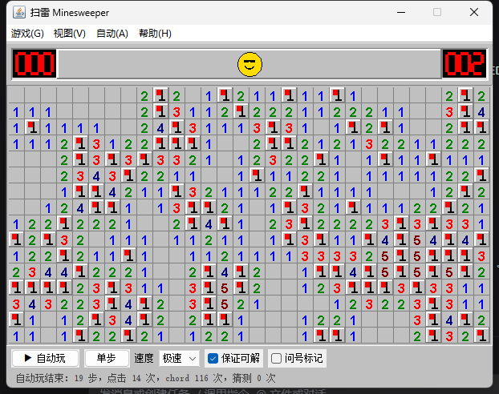
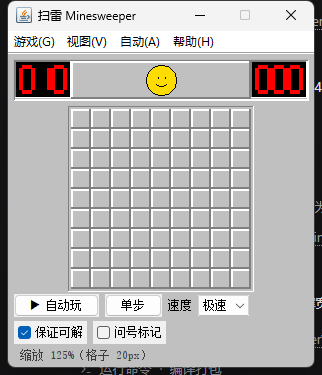
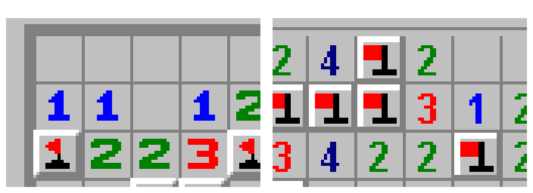

# Minesweeper

> A classic Minesweeper in Java / Swing, with two twists:
> it **generates boards that are solvable by pure logic** (no forced guesses),
> and it has a **built-in auto-player** backed by a proper solver.

[](LICENSE)


## Features

- **Classic difficulties + custom** — Beginner 9×9/10, Intermediate 16×16/40, Expert 30×16/99;
  custom boards from 5–60 columns, 5–40 rows and any mine count
- **Guaranteed solvable** — every board is verified by the solver: there must never be a moment
  where no cell is logically certain. If verification fails, the board is regenerated.
- **Auto-play** — built-in solver plays the whole game; four speeds, step mode, pause/resume,
  and it uses chording to flip several cells at once
- **Classic feel** — first click is safe and always opens an area, right-click flagging,
  chording, seven-segment LED counters, smiley restart button, mine/wrong-flag rendering
- **Zoom** — 100% (classic 16px) / 125% (default) / 150% / 200%
- **Zero dependencies** — pure JDK Swing, ships as a single ~50 KB jar

## Screenshots

Expert 30×16 after an auto-play win:



Beginner 9×9:



Cell grid compared pixel by pixel with the classic `saolei.exe` (left: classic, right: this project):



## Quick start

Requires **JDK 8+** (developed with JDK 24).

```bash
javac -encoding UTF-8 -d out src/minesweeper/*.java
jar --create --file minesweeper.jar --main-class minesweeper.MainFrame -C out .
java -jar minesweeper.jar
```

Auto demo:

```bash
java -jar minesweeper.jar --auto expert --exit   # play Expert automatically, print result, exit
```

## Why "no forced guesses" matters

Sampling 1000 purely random boards (12 samples per difficulty, measured by this project):

| Difficulty | Boards solvable by pure logic |
|---|---|
| Beginner 9×9/10 | 12/12 |
| Intermediate 16×16/40 | 9/12 |
| **Expert 30×16/99** | **only 1/12 ≈ 8%** |

In other words, **over 90% of classic Expert boards require guessing** — guess wrong and you lose.

This project generates a board, replays it with the solver, and rejects any board where a
"no certain move" situation appears, retrying until a purely logically solvable board is found
(3–8 attempts, a few hundred milliseconds, generated on a background thread).
You can turn this off via the **保证可解 / Guaranteed solvable** toggle to get classic random boards.

## Solver

Three levels of reasoning:

1. **Constraint propagation** — for every revealed number, "how many mines are still missing":
   if zero, all candidate cells are safe; if all, they are all mines
2. **Subset difference** — if constraint A's candidate set is a subset of B's, the difference has
   `needB − needA` mines
3. **Per-component enumeration + global mine count** — frontier cells are split by constraint
   connectivity, every legal assignment is enumerated, then weighted by a polynomial DP over
   "R mines remain on the board" to get an **exact mine probability** per cell

Cells with probability 0 or 1 are still certain conclusions, so the auto-player's
"0 guesses" really means it never gambled.

## Project layout

```
src/minesweeper/
  Solver.java          three-level solver
  GameModel.java       one game: board, reveal/flag/chord, flood fill, timer, win/lose
  BoardGenerator.java  board generation + "purely solvable" verification
  AutoPlayer.java      auto-play on a background thread, chord-aware
  MainFrame.java       main window, menus, LED panel, smiley, board, zoom
  BoardPanel.java      board rendering and mouse interaction
  LedCounter.java      seven-segment counters
  FaceButton.java      smiley button
  UiTheme.java         classic colors and drawing
  GenTest.java         generator/solver self-test
  HeadlessTest.java    headless auto-play test
```

## Tests

```bash
java -cp out minesweeper.GenTest        # solvable ratio and generation timing
java -cp out minesweeper.HeadlessTest   # headless auto-play, 5 games per difficulty
```

## License

[MIT](LICENSE) © 2026 guazyk550
